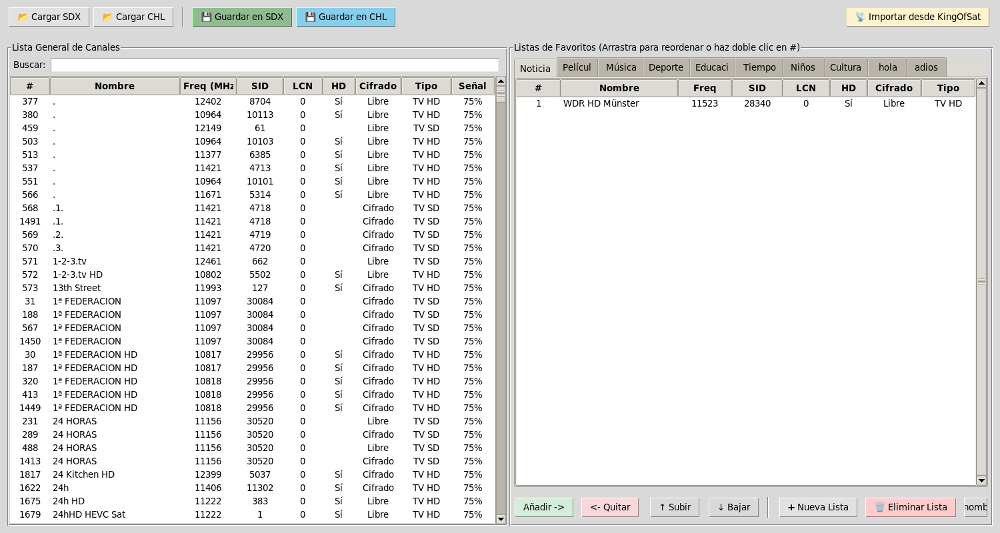
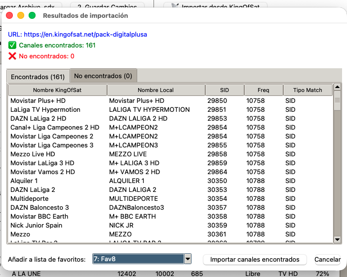

# Editor de Canales SDX

Editor gráfico para gestionar canales y listas de favoritos en receptores de satélite que utilizan archivos SDX. Esta herramienta te permite editar, reorganizar y gestionar tus canales de manera sencilla e intuitiva a través de una interfaz gráfica moderna.

## Descripción

Este editor ha sido desarrollado específicamente para trabajar con archivos de configuración SDX de receptores satelitales. Ofrece una interfaz visual que facilita la gestión de grandes listas de canales, permitiéndote organizar tus favoritos de forma eficiente sin necesidad de editar archivos manualmente.

## Capturas de Pantalla


*Vista principal del editor mostrando la lista de canales*


*Gestión y organización de listas de favoritos*

## Funcionalidades

- ✨ **Editor de favoritos**: Crea y edita múltiples listas de canales favoritos
- 🔄 **Reordenación intuitiva**: Arrastra y suelta canales para reorganizarlos fácilmente
- 📥 **Importación desde KingOfSat**: Importa paquetes de canales directamente desde KingOfSat
- 💾 **Gestión de archivos SDX**: Abre, edita y guarda archivos de configuración SDX
- 🎯 **Interfaz gráfica moderna**: Trabaja con tus canales de forma visual y sencilla

## Instalación

### Requisitos Previos

- Python 3.6 o superior
- Tkinter (interfaz gráfica)
- Git (para descargar el repositorio)

### Instalación en Linux

#### 1. Instalar Git

**Ubuntu/Debian:**
```bash
sudo apt update
sudo apt install git
```

**Fedora:**
```bash
sudo dnf install git
```

**Arch Linux:**
```bash
sudo pacman -S git
```

#### 2. Instalar Python y Tkinter

**Ubuntu/Debian:**
```bash
sudo apt update
sudo apt install python3 python3-tk
```

**Fedora:**
```bash
sudo dnf install python3 python3-tkinter
```

**Arch Linux:**
```bash
sudo pacman -S python tk
```

#### 3. Descargar el repositorio

```bash
git clone https://github.com/cdiazc/editor_canales_sat.git
cd editor_canales_sat
```

#### 4. Ejecutar el editor

```bash
python3 editor_canales.py
```

### Instalación en Windows

#### 1. Instalar Git

1. Descarga Git desde [https://git-scm.com/download/win](https://git-scm.com/download/win)
2. Ejecuta el instalador descargado
3. Sigue el asistente de instalación (puedes dejar las opciones por defecto)
4. Una vez instalado, abre "Git Bash" o "Símbolo del sistema"

#### 2. Instalar Python

1. Descarga Python desde [https://www.python.org/downloads/windows/](https://www.python.org/downloads/windows/)
2. Ejecuta el instalador
3. **IMPORTANTE**: Marca la casilla "Add Python to PATH" durante la instalación
4. Haz clic en "Install Now"
5. Tkinter se incluye automáticamente con Python en Windows

#### 3. Descargar el repositorio

Abre "Símbolo del sistema" o "PowerShell" y ejecuta:

```bash
git clone https://github.com/cdiazc/editor_canales_sat.git
cd editor_canales_sat
```

#### 4. Ejecutar el editor

```bash
python editor_canales.py
```

O simplemente haz doble clic en el archivo `editor_canales.py` desde el Explorador de Windows.

### Instalación en macOS

#### 1. Instalar Homebrew (si no lo tienes)

Abre la Terminal y ejecuta:

```bash
/bin/bash -c "$(curl -fsSL https://raw.githubusercontent.com/Homebrew/install/HEAD/install.sh)"
```

#### 2. Instalar Git

```bash
brew install git
```

O utiliza el Git que viene preinstalado con Xcode Command Line Tools:

```bash
xcode-select --install
```

#### 3. Instalar Python y Tkinter

```bash
brew install python-tk@3.12
```

O si ya tienes Python instalado:

```bash
brew install python-tk
```

#### 4. Descargar el repositorio

```bash
git clone https://github.com/cdiazc/editor_canales_sat.git
cd editor_canales_sat
```

#### 5. Ejecutar el editor

```bash
python3 editor_canales.py
```

## Uso

1. **Abrir un archivo SDX**: Haz clic en "Archivo" → "Abrir" y selecciona tu archivo SDX
2. **Editar canales**: Navega por las pestañas de favoritos y edita los canales
3. **Reorganizar**: Arrastra y suelta canales para cambiar su orden
4. **Importar desde KingOfSat**: Usa la opción de importación para agregar paquetes de canales
5. **Guardar cambios**: Haz clic en "Archivo" → "Guardar" para aplicar los cambios

## Notas Importantes

- El Viark Combo probablemente ignora los nombres de las listas de favoritos al importar y solo los lee cuando se renombran manualmente desde el menú del deco. Es una limitación del firmware.
- Se recomienda hacer una copia de seguridad de tus archivos SDX antes de editarlos.
- El editor muestra una advertencia si intentas cerrar la aplicación con cambios sin guardar.

## Licencia

Este proyecto es de código abierto. Siéntete libre de usarlo, modificarlo y compartirlo.

## Contribuciones

Las contribuciones son bienvenidas. Si encuentras algún error o tienes alguna sugerencia, no dudes en abrir un issue o enviar un pull request.
